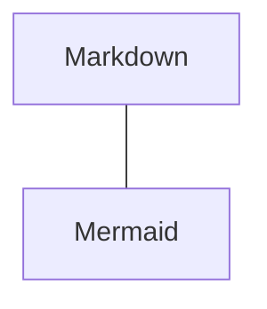
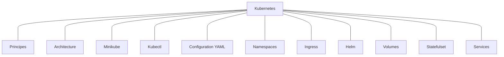

# Programme de formation

- [Markdown](markdown/markdown.md)
- [Kubernetes](kubernetes/kubernetes.md)

## Markdown

```mermaid
flowchart
M[Markdown]---Mermaid
```

## Kubernetes

```mermaid
flowchart
K[Kubernetes]----P[Principes]
K----A[Architecture]
K----M[Minikube]
K----CTL[Kubectl]
K----Y[Configuration YAML]
K----N[Namespaces]
K----I[Ingress]
K----H[Helm]
K----V[Volumes]
K----St[Statefulset]
K----Sv[Services]
```

