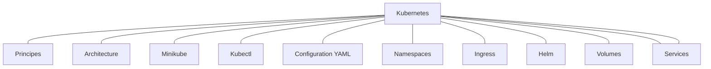

# Programme de formation
- [Programme de formation](#programme-de-formation)
  - [Kubernetes](#kubernetes)

## Kubernetes

```mermaid
flowchart
K[Kubernetes]---P[Principes]
K[Kubernetes]---A[Architecture]
K[Kubernetes]---M[Minikube]
K[Kubernetes]---CTL[Kubectl]
K[Kubernetes]---Y[Configuration YAML]
K[Kubernetes]---N[Namespaces]
K[Kubernetes]---I[Ingress]
K[Kubernetes]---H[Helm]
K[Kubernetes]---V[Volumes]
K[Kubernetes]---S[Statefulset]
K[Kubernetes]---S[Services]
```

