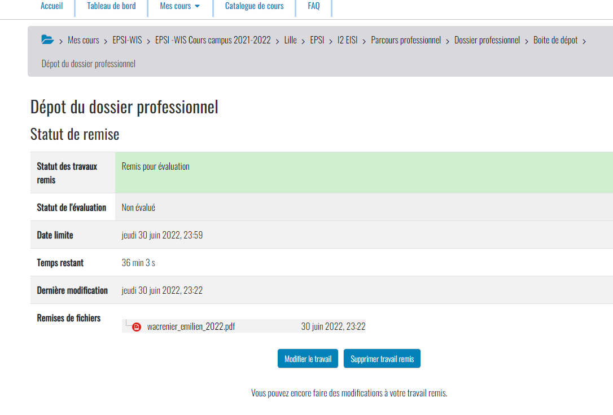

# Fiche Kubernetes

## Ressources
[Doc officielle](https://kubernetes.io/fr/docs/home/)

#### Youtube
[Techworld with Nana 4h course](https://www.youtube.com/watch?v=X48VuDVv0do&t=2385s)

## Principes
Kubernetes = Outil d'orchestration
Gestion de microservices (multiplication des containers)

**Avantages**
- Haute disponibilité
- Scalabilité
- Sauvegarde, récupération en cas d'incidents

## Architecture
#### Composants
Node 
- Virtual server, contient des Pods. 

Pod 
- Plus petite unité de Kubernetes (Couche d'abstraction d'un container). 
- Agnostique de solution conteneurization.
- 1 appli par pod
- IP unique par pod

Service
- IP permanante pour chaque pod.
- Cycle de vie déconnecté Pod / Service (Service ne change pas si pod meurt)
- Internal service (communication interne)
- External service (ouverture vers l'exterieur)

Ingress
- Redirige les requêtes vers les services adequats
- Donne un nom pour l'URL au lieu d'une IP

## Commandes de bases kubectl

