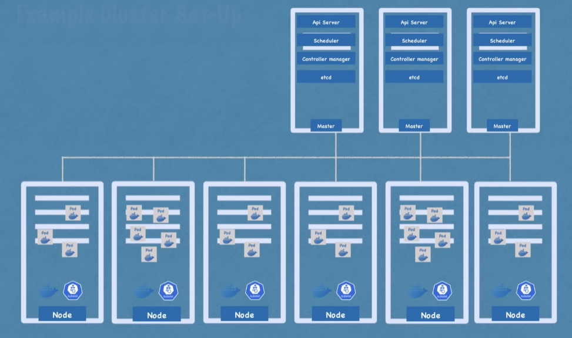

# Fiche Kubernetes

## Ressources
[Doc officielle](https://kubernetes.io/fr/docs/home/)

#### Youtube
[Techworld with Nana 4h course](https://www.youtube.com/watch?v=X48VuDVv0do&t=2385s)

## Principes
Kubernetes = Outil d'orchestration
Gestion de microservices (multiplication des containers)

**Avantages**
- Haute disponibilité
- Scalabilité
- Sauvegarde, récupération en cas d'incidents

## Architecture
#### Composants
**Node** 
- Virtual server, contient des Pods. 
- 3 processus indispensable dans chaque nodes
  - Container runtime
  - Kubelet --> Interface Container runtime et machine
  - Kube proxy, redirige les requêtes efficacement, limite la consommation réseaux

**Pod** 
- Plus petite unité de Kubernetes (Couche d'abstraction d'un container). 
- Agnostique de solution conteneurisation.
- 1 appli par pod
- IP unique par pod

**Service**
- IP permanante pour chaque pod.
- Cycle de vie déconnecté Pod / Service (Service ne change pas si pod meurt)
- Internal service (communication interne)
- External service (ouverture vers l'exterieur)
- Est un load balancer

**Ingress**
- Redirige les requêtes vers les services adequats
- Donne un nom pour l'URL au lieu d'une IP

**ConfigMap**
- Configuration externe de l'application (URL de BDD)
- Connexion ConfigMap et pod pour acceder aux données
- Ne pas mettre de données confidentielles

**Secret**
- Comme ConfigMap mais pour les secrets
- Encodé en base64

**Volume**
- Pod redémarre = données perdues
- Stocke les données d'une BDD d'un pod sur le disque
- Permet la persistence des données
- Kubernetes ne gère pas de redondance ...

**Deployment**
- Comparable a une classe pour un objet
- Couche d'abstraction du pod
- Permet de repliquer des les pods
- Fonctionne que pour ce qui est stateless (pas les BDD)

**StatefulSet**
- Deployment pour ce qui a un state
- Pas simple et pas conseillé

**Master node**
- API server (cluster gateway)
- Scheduler (décide des tâches)
  - Allocation intelligente de ressources
  - Kubelet réalise les tâches
- Controller manager (Détecte les changements d'états)
  - Fais des demmandes au Scheduler pour rétablir des pods ...
- etcd (stockage clé-valeur)
  - C'est le cerveau
  - Tous les autres services se servent d'etcd
  - Etat du cluster

#### Exemple de cluster

## Commandes de bases kubectl

