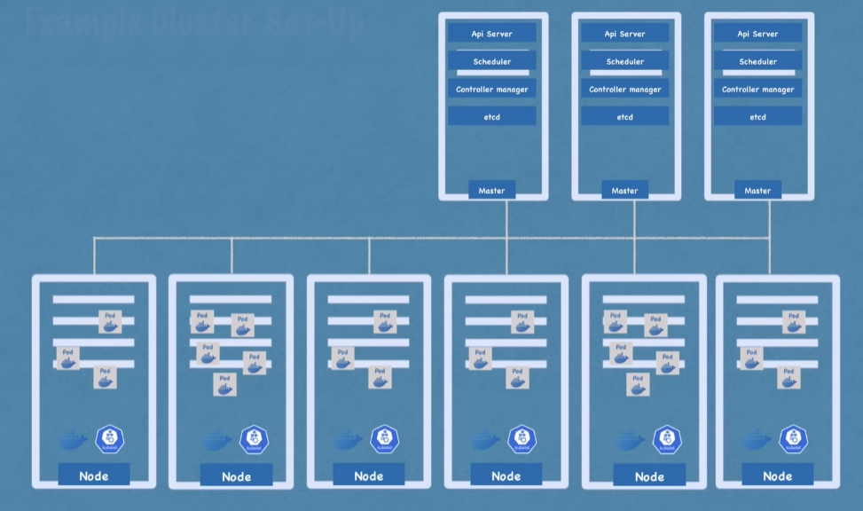
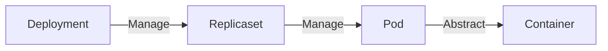
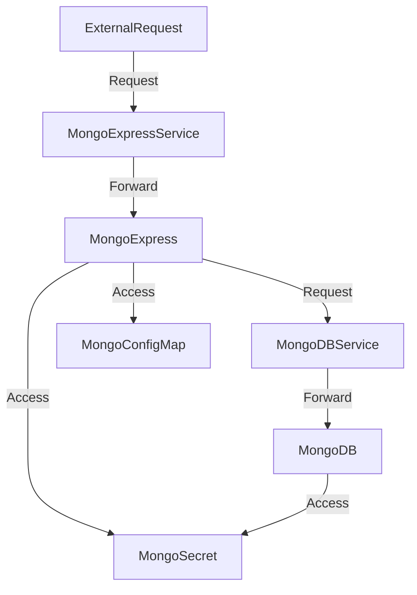
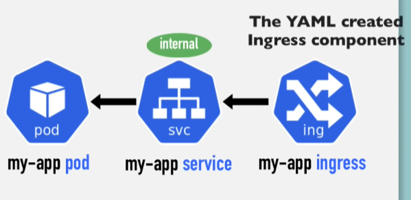

# Fiche Kubernetes
- [Fiche Kubernetes](#fiche-kubernetes)
  - [Ressources](#ressources)
      - [Doc](#doc)
      - [Youtube](#youtube)
  - [Principes](#principes)
  - [Architecture](#architecture)
      - [Composants](#composants)
      - [Exemple de cluster](#exemple-de-cluster)
  - [Minikube](#minikube)
  - [Commandes de bases kubectl & minikube](#commandes-de-bases-kubectl--minikube)
  - [Configuration file](#configuration-file)
  - [Namespace](#namespace)
  - [Ingress](#ingress)
  - [Helm package manager](#helm-package-manager)
  - [Volumes](#volumes)
  - [StatefulSet](#statefulset)


## Ressources
#### Doc
[Doc officielle](https://kubernetes.io/fr/docs/home/)
[Minikube](https://minikube.sigs.k8s.io/docs/start/)
#### Youtube
[Techworld with Nana 4h course](https://www.youtube.com/watch?v=X48VuDVv0do&t=2385s)

## Principes
Kubernetes = Outil d'orchestration
Gestion de microservices (multiplication des containers)

**Avantages**
- Haute disponibilité
- Scalabilité
- Sauvegarde, récupération en cas d'incidents

## Architecture
#### Composants
**Node** 
- Virtual server, contient des Pods. 
- 3 processus indispensable dans chaque nodes
  - Container runtime
  - Kubelet --> Interface Container runtime et machine
  - Kube proxy, redirige les requêtes efficacement, limite la consommation réseaux

**Pod** 
- Plus petite unité de Kubernetes (Couche d'abstraction d'un container). 
- Agnostique de solution conteneurisation.
- 1 appli par pod
- IP unique par pod

**Service**
- IP permanante pour chaque pod.
- Cycle de vie déconnecté Pod / Service (Service ne change pas si pod meurt)
- Internal service (communication interne)
- External service (ouverture vers l'exterieur)
- Est un load balancer

**Ingress**
- Redirige les requêtes vers les services adequats
- Donne un nom pour l'URL au lieu d'une IP

**ConfigMap**
- Configuration externe de l'application (URL de BDD)
- Connexion ConfigMap et pod pour acceder aux données
- Ne pas mettre de données confidentielles

**Secret**
- Comme ConfigMap mais pour les secrets
- Encodé en base64

**Volume**
- Pod redémarre = données perdues
- Stocke les données d'une BDD d'un pod sur le disque
- Permet la persistence des données
- Kubernetes ne gère pas de redondance ...

**Deployment**
- Comparable a une classe pour un objet
- Couche d'abstraction du pod
- Permet de repliquer des les pods
- Fonctionne que pour ce qui est stateless (pas les BDD)

**StatefulSet**
- Deployment pour ce qui a un state
- Pas simple et pas conseillé

**Master node**
- API server (cluster gateway)
  - Communication avec API
  - Avec UI
  - Avec CLI (Kubectl plus puissant)
- Scheduler (décide des tâches)
  - Allocation intelligente de ressources
  - Kubelet réalise les tâches
- Controller manager (Détecte les changements d'états)
  - Fait des demmandes au Scheduler pour rétablir des pods ...
- etcd (stockage clé-valeur)
  - C'est le cerveau
  - Tous les autres services se servent d'etcd
  - Etat du cluster

#### Exemple de cluster


## Minikube
Créé un environnement virtuel sur le PC
C'est un node kubernetes qui sert de cluster
Utilisé pour tester en local

Pour associer une IP externe a un service spécifiquement dans Minikube
```
minikube service NAME
```

## Commandes de bases kubectl & minikube
Démarrer un cluster local avec minikube (avec docker, hyperkit ...)
```
minikube start --driver=docker
```

Lister les nodes ou
- pod
- deployment
- services
- ...
```
kubectl get nodes
```

Crééer un pod (on créé des deployment pas des pods)
```
kubectl create deployment NAME --image=IMAGE
```



Editer la configuration d'un deployment
```
kubectl edit deployment NAME
```

Afficher les logs d'un pod
```
kubectl logs NAME
```

Ouvrir un terminal intéractif du pod
```
kubectl exec -it NAME -- bin/bash
```

Supprimer un pod
```
kubectl delete deployment NAME
```

## Configuration file
Permet de ne pas taper manuellement des commandes avec kubectl mais de les enregistrer dans un fichier YAML.

```
kubectl apply -f NAME
```

Chaque ficher de configuration a 3 parties
- Metadata (nom du composant ...)
- Specifications (nombre de replicas ...)
- Status (Automatiquement ajouté par kubernetes)

Les fichier de configurations ont leurs propres attributs pour un deployment ou un service ...

On les stockent en général avec le code des applications ou dans un repo a part

Les labels clé-valeurs permettent de connecter les pods et services et deployment

Exemple de configuration file **deployment**
```yaml
apiVersion: apps/v1
kind: Deployment
metadata:
  name: nginx-deployment
  labels:
    app: nginx
spec:
  replicas: 2
  selector:
    matchLabels:
      app: nginx
  template:
    metadata:
      labels:
        app: nginx
    spec:
      containers:
        - name: nginx
          image: nginx:1.16
          ports:
            - containerPort: 80
```

Exemple de configuration file **service**
```yaml
apiVersion: v1
kind: Service
metadata:
  name: nginx-service
spec:
  selector:
    app: nginx
  ports:
    - protocol: TCP
      port: 80
      targetPort: 8080
```

Dans le service, le "selector: app: nginx" fait référence au label dans le deployment

Un **external service**
```yaml
apiVersion: v1
kind: Service
metadata:
  name: mongo-express-service
spec:
  selector:
    app: mongo-express
  type: LoadBalancer
  ports:
    - protocol: TCP
      port: 8081
      targetPort: 8081
      nodePort: 30000
```
Type: LoadBalancer pour accepter les requêtes extérieures
nodePort: pour définir le port extérieur

Récap archi kubernetes services avec exemple MongoDB et MongoExpress


## Namespace
Namespace = cluster virtuel dans un cluster kubernetes
4 namespace par défaut
```mermaid
flowchart TB
  subgraph Cluster
    subgraph kube-system
      A[Not for our use]
      B[system process / kubectl ...]
    end
    subgraph kube-public
      C[Contient les infos publiques]
    end
    subgraph kube-node-lease
      D[Disponibilité des nodes]
    end
    subgraph default
      E[Namespace par défaut]
    end

  end
```

Créer un namespace
```
kubectl create namespace NAME
```

Namespace configuration file mieux (historique, mieux gérable)

Cas d'utilisation de namespaces
- Structurer des composants
- Eviter les conflits entre les équipes
- Partager des ressources pour différents environnements
- Accèder et limiter les ressources

Certaines ressources ne sont pas dispo à l'exterieur d'un namespace (configMap, secret ...) Mais les services sont partageables.

Les volumes pour la persistance ne peuvent être créés dans un namespace
## Ingress
Permet de donner une vraie URL au lieu d'une IP:PORT pour un service exposé.
On utilise plus d'external service mais internal service mappé avec Ingress

Architecture avec ingress

## Helm package manager

## Volumes

## StatefulSet